# Emporium Accessories Web Application

Welcome to the **Emporium Accessories** Next.js project! This repository contains a fully functional web application with:

- 🌐 Live site: [the-accessories-emporium.vercel.app](https://the-accessories-emporium.vercel.app)

- 🔒 Role‑based authentication (Admin & Customer)
- 🎨 Responsive, Tailwind‑CSS UI
- 📊 Informational sections (Owner, Team, Branches, Why Join Us, Testimonials)
- 📱 Sticky side panels and clean layouts
- 📁 Easy image management via the `assets` folder

---


## Table of Contents

1. [Demo](#demo)
2. [Features](#features)
3. [Tech Stack](#tech-stack)
4. [Getting Started](#getting-started)

---

## Demo

### Authentication

#### Login Page
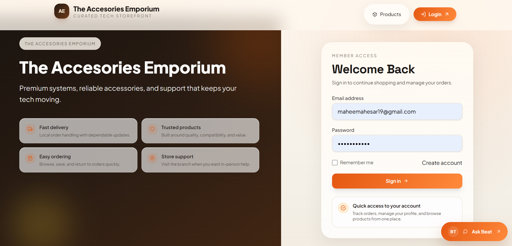

#### SignUp Page
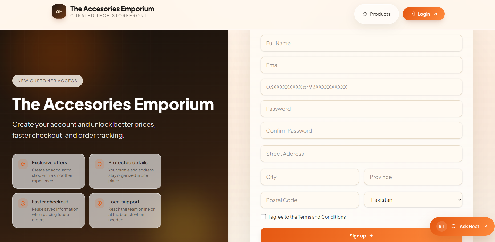

<!-- ### Power BI Analytics -->

<!-- #### Products Analytics Pages
 -->

#### Studio View Analytics
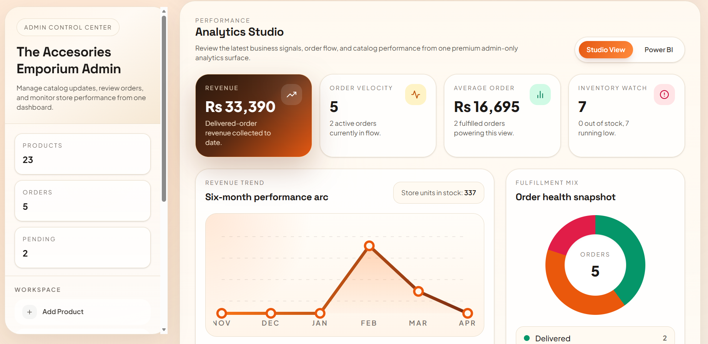

### Customer Functionalities

#### Home Page 
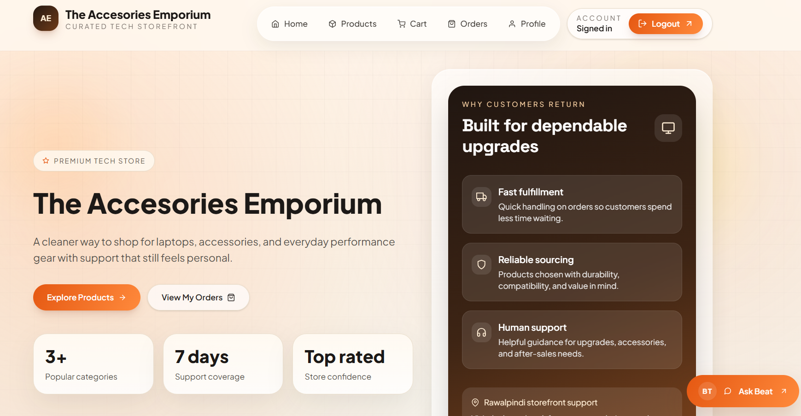

#### Product View Page 
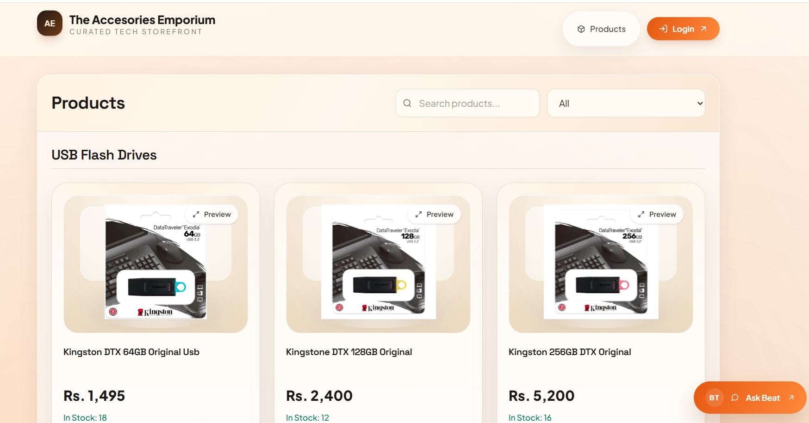

#### Product Search and Filter Page 


#### Cart Page 
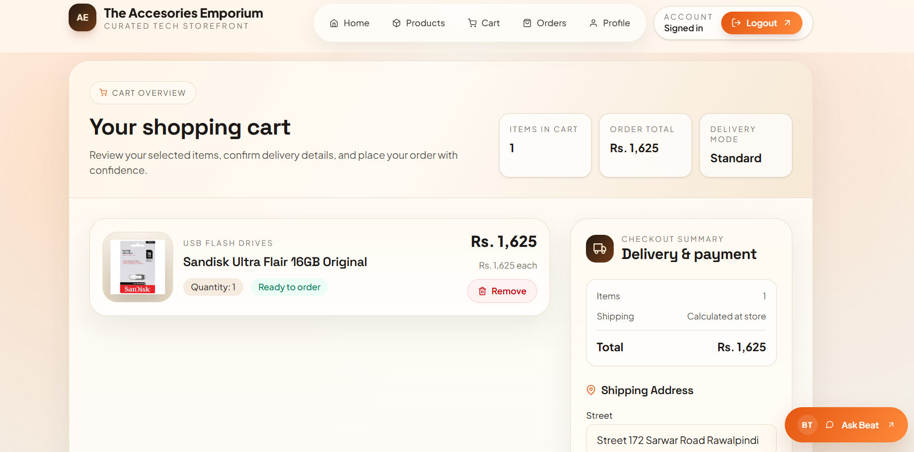

#### Orders Page 
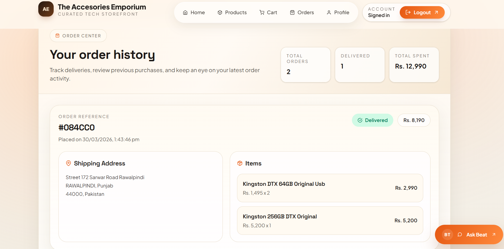

#### User Profile Page
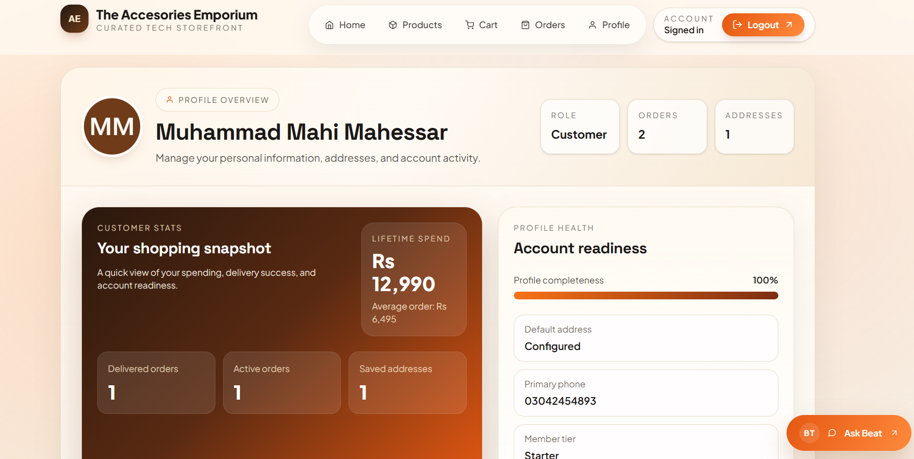

### Admin Functionalities

#### Add Product Page
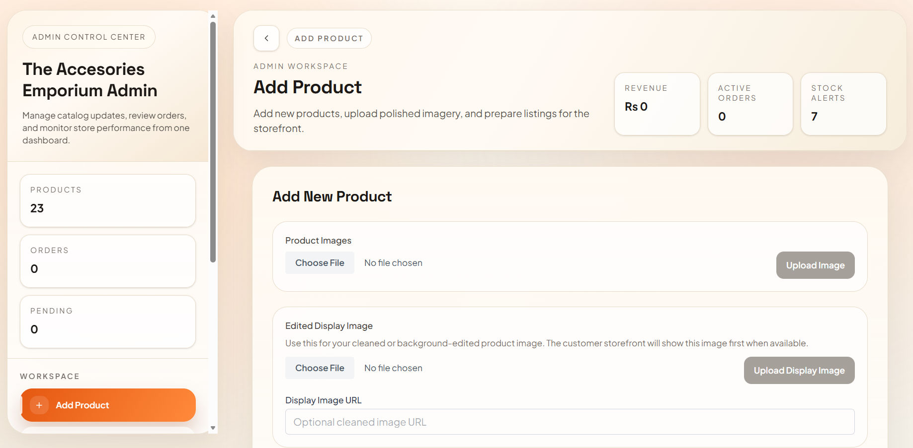

#### Product Listing and Edit Page
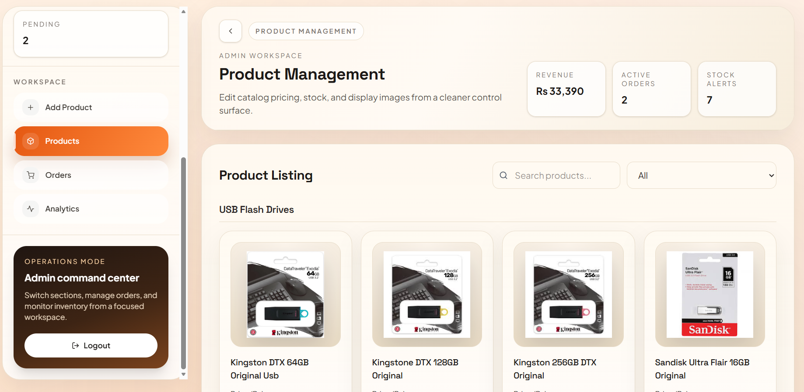

#### Product Preview Modal
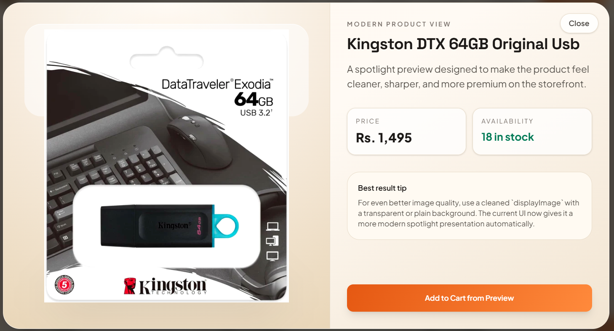

#### Search and Sort by Category
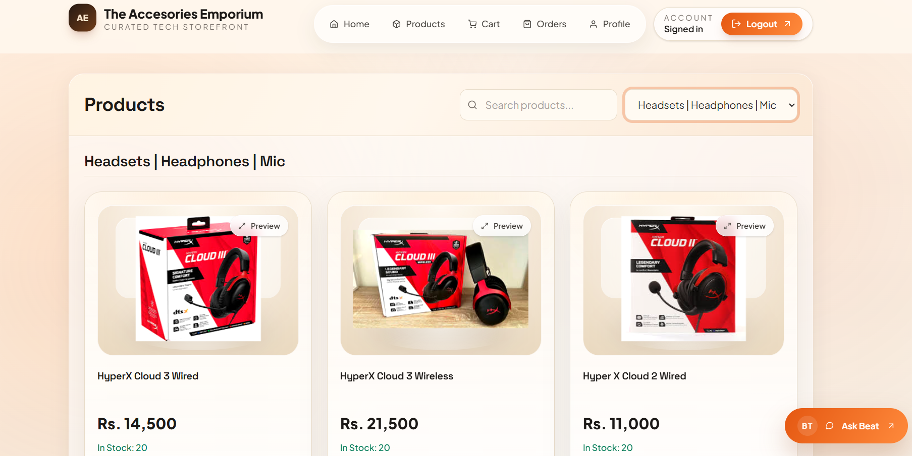

#### Orders Page
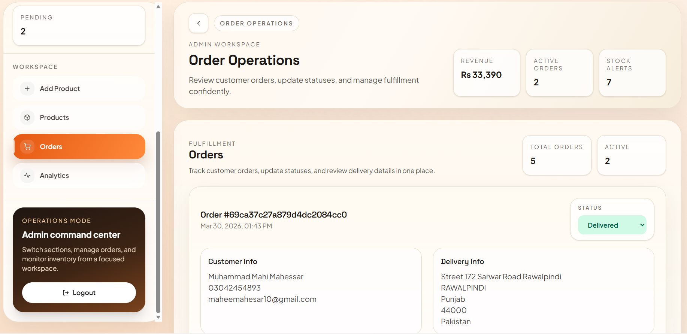

### Extra Application Screens

#### AI Assistant
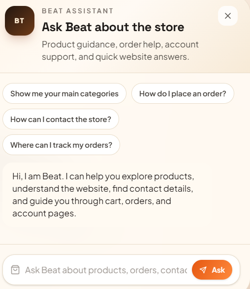

---

## Features

# Functional Features
- **User Signup & Login** (JWT in HTTP‑only cookies)
- **Role Guarding**: Separate dashboards for `admin` and `customer`
- **Customer Home Page**: A storefront landing page with featured categories and quick access to products and orders.
- **Product Details Page**: View detailed information about a product, including images, price, description, stock, and multiple preview images.
- **Product Search and Filtering**: Search products by name and filter them by category on the customer products page.
- **Shopping Cart**: Add products to the shopping cart, view cart details, and place orders with a shipping address.
- **Order Tracking**: Review customer order history and track statuses such as pending, processing, shipped, delivered, and cancelled.
- **Profile Page**: Separate customer profile page with account details and order summary.
- **Admin Product Management**: Add products, edit pricing and stock, update display images, and manage catalog listings.
- **Admin Analytics Studio**: View revenue, stock, fulfillment, category sales, weekday demand, and top products.
- **AI Assistant**: Use the Beat assistant for product guidance, order help, contact info, and store navigation.

# Additional Feature
- **Informational Sections**: Owner, Manager, Team members, Branches, Why Join Us, Testimonials
- **Footer**: Contact info, quick links, social media icons
- **Mobile‑friendly**: Tailwind CSS grid and responsive utilities
- **Responsive Design**: Works seamlessly across all device sizes


---

## Tech Stack

- **Framework**: Next.js App Router
- **UI**: React, Tailwind CSS
- **State**: React Context API
- **API Requests**: Axios
- **Auth**: JWT with HTTP‑only cookies
- **Database**: MongoDB via Mongoose


---

## Getting Started

### Prerequisites

- Node.js v16+
- npm or Yarn

### Installation

1. **Clone** the repo:
   ```bash
   git clone https://github.com/MuhammadMahi585/The-Accessories-Emporium.git
   cd Xp
## Install dependencies:

npm i

## Run the website

npm run dev


