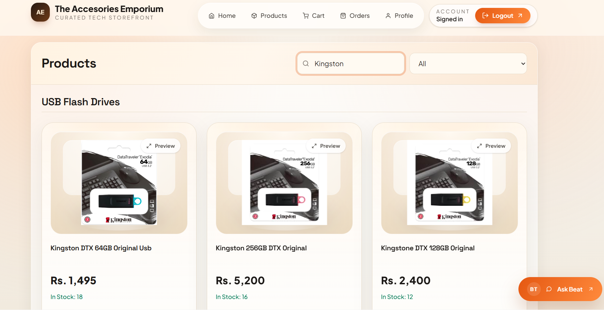

# The Accesories Emporium

A modern Next.js ecommerce application for computer accessories, customer shopping, and admin operations.

This project includes:

- Role-based authentication for `admin` and `customer`
- Premium storefront UI with refreshed dashboards and account pages
- Product catalog, cart, checkout flow, and order history
- Admin product management, order control, and analytics studio
- MongoDB-powered data layer with JWT-based authentication
- Power BI support for embedded analytics reporting

## Live Website

`https://xpcomputers.shop`

## UI Preview

These screenshots are included from the repository asset folder.

### Authentication

#### Login


#### Signup


### Customer Experience

#### Customer Home


#### Product View


#### Product Search


#### Cart


#### Orders


#### Profile


### Admin Experience

#### Add Product


#### Product Management


#### Product Search


#### Product Filtering


#### Orders Management


### Analytics

#### Products Analytics


#### Sales Analytics


#### User Analytics


## Features

### Customer Features

- User signup and login with JWT cookies
- Browse and search products by name and category
- View product details and stock availability
- Add products to cart and manage quantities
- Place orders with saved shipping addresses
- View order history and profile stats

### Admin Features

- Secure admin-only dashboard
- Add and manage products
- Upload primary product images and separate cleaned display images
- Review all orders and update fulfillment status
- Use custom analytics visuals and embedded Power BI reports

### UI Highlights

- Premium warm-toned storefront design
- Redesigned navigation, authentication, cart, orders, and profile pages
- Updated admin dashboard, analytics studio, and footer styling
- Responsive layout for desktop and mobile screens

## Tech Stack

- Next.js App Router
- React
- Tailwind CSS
- Axios
- MongoDB
- Mongoose
- JWT authentication
- Framer Motion
- Power BI embed

## Project Structure

```text
src/app/
  api/                      API routes
  components/               App pages and shared UI
  context/                  Authentication context
  lib/                      Helpers and utilities
  models/                   Mongoose models
public/
  assets/                   Static images
  uploads/                  Uploaded product images
assets/                     README screenshots
```

## Getting Started

### Prerequisites

- Node.js 18+
- npm
- MongoDB Atlas connection string

### Environment Variables

Create a `.env.local` file in the project root:

```env
MONGODB_URI="your-mongodb-uri"
JWT_SECRET="your-jwt-secret"
BLOB_READ_WRITE_TOKEN="your-vercel-blob-token"
```

### Installation

```bash
git clone https://github.com/MuhammadMahi585/Xp
cd Xp
npm install
```

### Run Development Server

```bash
npm run dev
```

Open:

```text
http://localhost:3000
```

### Production Build

```bash
npm run build
npm run start
```

## Notes

- The app uses Google fonts in `src/app/layout.js`, so builds may fail in fully offline environments unless those fonts are replaced or made local.
- Admin analytics now include an in-code visual dashboard in addition to the embedded Power BI report.
- If you want truly up-to-date README screenshots, replace the images inside the `assets/` folder with fresh captures from the latest UI.
